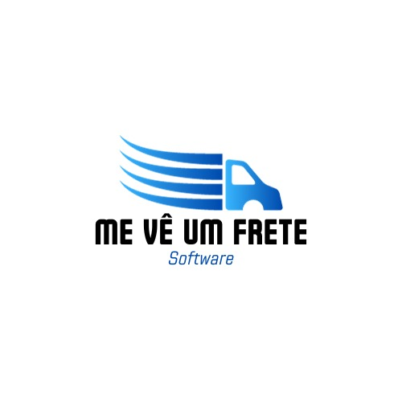

# Me Vê um Frete <br> 

## Versão: 0.8.1-alpha.1

## Status do Projeto: ⚠️ Espera

## Tópicos

🔹 [Descrição do projeto](#descrição-do-projeto)

🔹 [Funcionalidades](#funcionalidades)

🔹 [Pré-requisitos](#pré-requisitos)

🔹 [Como rodar a aplicação](#como-rodar-a-aplicação)

🔹 [Testes realizados](#testes-realizados)

🔹 [Banco de Dados](#banco-de-dados)

🔹 [Linguagens, dependências e libs utilizadas](#linguagens-dependencias-e-libs-utilizadas)

🔹 [Desenvolvedores/Contribuintes](#desenvolvedorescontribuintes)

## Descrição do projeto

O Me Vê Um Frete oferece uma solução abrangente para atender às necessidades do setor de transporte. Ele permite que os usuários se cadastrem como clientes ou prestadores de serviço. Com isso, na plataforma o usuário poderá estabelecer parâmetros de origem, destino e data do serviço para então, com base neles, solicitar um serviço que possa vir atender o seu interesse.

Por outro lado, os prestadores de serviços têm à disposição na plataforma um ambiente adequado para ofertar os seus serviços, de acordo com a sua disponibilidade. Esses serviços ficarão visíveis para os usuários, com base em filtros que consideram os critérios estabelecidos.

## Funcionalidades

✔️ Cadastro de usuário cliente

✔️ Cadastro de usuário prestador de serviço

✔️ Login no sistema

✔️ (Cliente) Busca por serviços de frete

✔️ (Cliente) Visualização dos prestadores de serviço que atendendem a sua necessidade

✔️ (Cliente) Realizar solicitação de serviço para o prestador de serviço selecionado

✔️ (Cliente) Realizar pagamento pelo serviço

✔️ (Prestador) Gerenciar suas solicitações de serviço

✔️ (Cliente e Prestador) Gerenciar os serviços futuros e os já finalizados

✔️ (Super User) Gerenciar solicitações de registro de prestadores de serviço

## Pré-requisitos

Node.js (versão 20.9.0);

npm (versão 10.1.0);

Angular CLI (versão 16.2.0)

Nx (15.8.0 <= latest)

## Como rodar a aplicação

Para rodar a aplicação basta executar os comandos abaixo no terminal dentro do diretorio do projeto. Em seguida abra o seu navegador e navegue para3 http://localhost:4200/.

```
npm install
npm run dev
```

## Testes realizados

Para testar nossa aplicação nossa equipe de desenvolvimento realizos os seguintes testes:

TESTE DE SISTEMA - Testar se um sistema funciona corretamente.


TESTE DE ACEITAÇÃO - Testar se o sistema atende ás necessidades e expectativas do cliente.


TESTE DE CAIXA BRANCA - Testar os métodos da tela de Login.


TESTE DE REQUISITOS NÃO FUNCIONAIS - Testar alguns tópicos dentre os tipos,Desempenho, Usuabilidade, Segurança e Portabilidade.


## Banco de Dados

Para a parte do back-end do projeto estamos utilizando o [Xano](https://www.xano.com), uma ferramenta No-Code onde é possivel construir toda a parte de banco de dados e back-end do seu projeto web, mével ou IoT.

## Linguagens, dependencias e libs utilizadas


- Angular v.16.2
- RxJS
- Bootstrap
- Imask
- NgxCookieService
- NgxToastr
- SVG to TS

## Desenvolvedores/Contribuintes:

PROGRAMADOR PRINCIPAL

- Nicolas Sol Guerreiro de Andrade Frederico

EQUIPE DE DESENVOLVIMENTO/TESTERS

- Felipe Sanches Franqueira

- Jeferson Pereira Murat Junior

- José Marcos Rezende Júnior

- Luiz Fernando Meira Minozi

- Rafael Modena Jakubovsky

- Vinícius Kalach Freitas Cato

## Licença

The MIT License (MIT)

## Copyright ©️ 2023 - Me Vê um Frete
